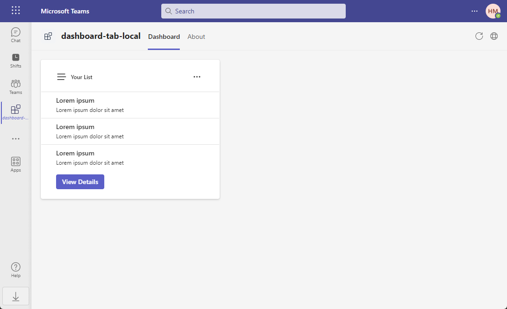
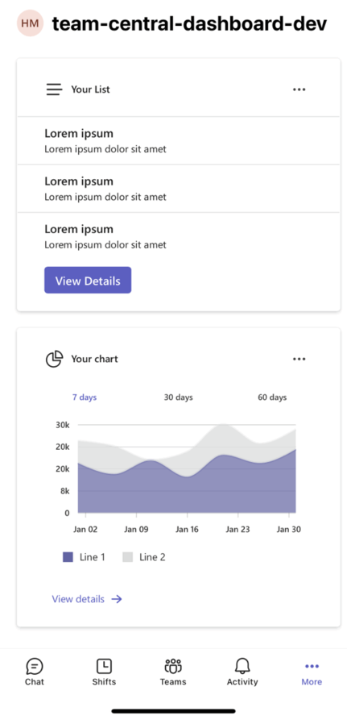
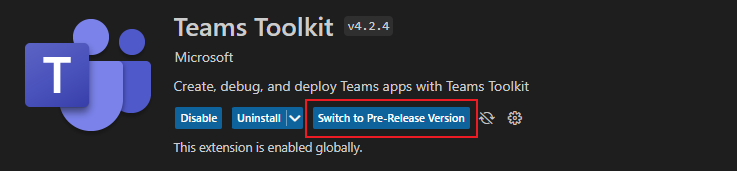

# Overview

This repository designed to assist developers in quickly building a Teams dashboard tab application using the TeamsFx SDK.

| [SDK Documentation](./sdk-usage.md) | [API Reference](./doc/index.md) |
| ----------------------------------- | ------------------------------- |

# Table of Contents

1. [Introduction](#introduction)
2. [Getting Started](#getting-started)
   - [Prerequisites](#prerequisites)
   - [Try it out](#try-it-out)
3. [Understanding the Code](#understanding-the-code)
4. [How to Add a New Widget](#how-to-add-a-new-widget)
5. [How to Add a New Dashboard](#how-to-add-a-new-dashboard)
6. [How to Override the Default Style](#how-to-override-the-default-style)
   - [Override the default style for the widget](#override-the-default-style-for-the-widget)
   - [Override the default style for the dashboard](#override-the-default-style-for-the-dashboard)
7. [How to Add a New Graph Api Call](#how-to-add-a-new-graph-api-call)

# Introduction

This is a Teams tab app that uses the [Fluent UI](https://react.fluentui.dev/?path=/docs/concepts-introduction--page) to display multiple cards that provide an overview of data or content in Microsoft Teams.



When you open this app in mobile Teams, it will automatically switch to a mobile-friendly layout.



<p align="right"><a href="#table-of-contents">back to top</a></p>

# Getting Started

### Prerequisites

- [NodeJS](https://nodejs.org/en/), fully tested on NodeJS 14, 16, 18
- A Microsoft 365 account. If you do not have Microsoft 365 account, apply one from [Microsoft 365 developer program](https://developer.microsoft.com/en-us/microsoft-365/dev-program)
- [Teams Toolkit Visual Studio Code Extension](https://aka.ms/teams-toolkit) or [TeamsFx CLI](https://aka.ms/teamsfx-cli). If you are using Teams Toolkit Visual Studio Code Extension, please make sure you have installed the pre-release version, you can switch to pre-release version by clicking the switch button in the Teams Toolkit VS Code extension page, or you can install the pre-release version from [here](https://marketplace.visualstudio.com/_apis/public/gallery/publishers/TeamsDevApp/vsextensions/ms-teams-vscode-extension/4.99.2023022208/vspackage).



### Try it out

Run your app with local debugging by pressing `F5` in VSCode. Select `Debug (Edge)` or `Debug (Chrome)`.

<p align="right"><a href="#table-of-contents">back to top</a></p>

# Understanding the Code

This section walks through the generated code. The project folder contains the following:

| Folder       | Contents                                            |
| ------------ | --------------------------------------------------- |
| `.vscode`    | VSCode files for debugging                          |
| `appPackage` | Templates for the Teams application manifest        |
| `env`        | Environment files                                   |
| `infra`      | Templates for provisioning Azure resources          |
| `src`        | The source code for the dashboard Teams application |

The following files provide the business logic for the dashboard tab. These files can be updated to fit your business logic requirements. The default implementation provides a starting point to help you get started.

| File                                 | Contents                                           |
| ------------------------------------ | -------------------------------------------------- |
| `src/data/ListData.json`             | Data for the list widget                           |
| `src/models/chartModel.ts`           | Data model for the chart widget                    |
| `src/models/listModel.ts`            | Data model for the list widget                     |
| `src/services/chartService.ts`       | A data retrive implementation for the chart widget |
| `src/services/listService.ts`        | A data retrive implementation for the list widget  |
| `src/dashboards/SampleDashboard.tsx` | A sample dashboard layout implementation           |
| `src/styles/ChartWidget.css`         | The chart widget style file                        |
| `src/styles/ListWidget.css`          | The list widget style file                         |
| `src/widgets/ChartWidget.tsx`        | A widget implementation that can display a chart   |
| `src/widgets/ListWidget.tsx`         | A widget implementation that can display a list    |

The following files are project-related files. You generally will not need to customize these files.

| File                               | Contents                                                     |
| ---------------------------------- | ------------------------------------------------------------ |
| `src/index.tsx`                    | Application entry point                                      |
| `src/App.tsx`                      | Application route                                            |
| `src/internal/addNewScopes.ts`     | Implementation of new scopes add                             |
| `src/internal/context.ts`          | TeamsFx Context                                              |
| `src/internal/login.ts`            | Implementation of login                                      |
| `src/internal/singletonContext.ts` | Implementation of the TeamsUserCredential instance singleton |

<p align="right"><a href="#table-of-contents">back to top</a></p>

# How to Add a New Widget

You can use the following steps to add a new widget to the dashboard:

1. [Step 1: Define a data model](#step-1-define-a-data-model)
2. [Step 2: Create a data retrive service](#step-2-create-a-data-retrive-service)
3. [Step 3: Create a widget file](#step-3-create-a-widget-file)
4. [Step 4: Add the widget to the dashboard](#step-4-add-the-widget-to-the-dashboard)

### Step 1: Define a data model

Define a data model based on the business scenario, and put it in `src/models` folder. The widget model defined according to the data you want to display in the widget. Here's a sample data model:

```typescript
export interface SampleModel {
  content: string;
}
```

### Step 2: Create a data retrive service

Simplely, you can create a service that returns dummy data. We recommend that you put data files in the `src/data` folder, and put data retrive services in the `src/services` folder.

Here's a sample json file that contains dummy data:

```json
{
  "content": "Hello world!"
}
```

Here's a dummy data retrive service:

```typescript
import { SampleModel } from "../models/sampleModel";
import SampleData from "../data/SampleData.json";

export const getSampleData = (): SampleModel => SampleData;
```

> Note: You can also implement a service to retrieve data from the backend service or from the Microsoft Graph API.

### Step 3: Create a widget file

Create a widget file in `src/widgets` folder. Inherit the `BaseWidget` class from [@microsoft/teamsfx-react](https://www.npmjs.com/package/@microsoft/teamsfx-react/v/3.0.1-alpha.ru6q1vrv0.0). The following table lists the methods that you can override to customize your widget.

| Methods     | Function                                                                                                                                      |
| ----------- | --------------------------------------------------------------------------------------------------------------------------------------------- |
| `getData()` | This method is used to get the data for the widget. You can implement it to get data from the backend service or from the Microsoft Graph API |
| `header()`  | Customize the content of the widget header                                                                                                    |
| `body()`    | Customize the content of the widget body                                                                                                      |
| `footer()`  | Customize the content of the widget footer                                                                                                    |
| `styling()` | Customize the widget style                                                                                                                    |

> All methods are optional. If you do not override any method, the default widget layout will be used.

Here's a sample widget implementation:

```tsx
import { Button, Text } from "@fluentui/react-components";
import { BaseWidget } from "@microsoft/teamsfx-react";
import { SampleModel } from "../models/sampleModel";
import { getSampleData } from "../services/sampleService";

interface SampleWidgetState {
  data?: SampleModel;
}

export class SampleWidget extends BaseWidget<any, SampleWidgetState> {
  async getData(): Promise<SampleWidgetState> {
    return { data: getSampleData() };
  }

  header(): JSX.Element | undefined {
    return <Text>Sample Widget</Text>;
  }

  body(): JSX.Element | undefined {
    return <div>{this.state.data?.content}</div>;
  }

  footer(): JSX.Element | undefined {
    return <Button>View Details</Button>;
  }
}
```

### Step 4: Add the widget to the dashboard

1. Go to `src/dashboards/SampleDashboard.tsx`, if you want create a new dashboard, please refer to [How to add a new dashboard](#how-to-add-a-new-dashboard).
2. Update your `layout()` method to add the widget to the dashboard:

```tsx
protected layout(): JSX.Element | undefined {
  return (
    <>
      <ListWidget />
      <ChartWidget />
      <SampleWidget />
    </>
  );
}
```

> Note: If you want put your widget in a column, you can refer to the following code:

```tsx
const oneColumn = mergeStyles({
  display: "grid",
  gap: "20px",
  gridTemplateRows: "1fr 1fr",
});

protected dashboardLayout(): JSX.Element | undefined {
  return (
    <>
      <ListWidget />
      <div className={oneColumn()}>
        <ChartWidget />
        <SampleWidget />
      </div>
    </>
  );
}
```

<p align="right"><a href="#table-of-contents">back to top</a></p>

# How to add a new dashboard

You can use the following steps to add a new dashboard layout:

1. [Step 1: Create a dashboard class](#step-1-create-a-dashboard-class)
2. [Step 2: Override methods to customize dashboard layout](#step-2-override-methods-to-customize-dashboard-layout)
3. [Step 3: Add a route for the new dashboard](#step-3-add-a-route-for-the-new-dashboard)
4. [Step 4: Modify manifest to add a new dashboard tab](#step-4-modify-manifest-to-add-a-new-dashboard-tab)

### Step 1: Create a dashboard class

Create a file with the extension `.tsx` for your dashboard in the `src/dashboards` directory, for example, `YourDashboard.tsx`. Then, define a class that inherits the `BaseDashboard` class from [@microsoft/teamsfx-react](https://www.npmjs.com/package/@microsoft/teamsfx-react/v/3.0.1-alpha.ru6q1vrv0.0).

```tsx
export default class YourDashboard extends BaseDashboard<any, any> {}
```

### Step 2: Override methods to customize dashboard layout

The `BaseDashboard` class provides some methods that you can override to customize the dashboard layout. The following table lists the methods that you can override.

| Methods     | Function                             |
| ----------- | ------------------------------------ |
| `styling()` | Customize the style of the dashboard |
| `layout()`  | Define widgets layout                |

Here is an example to customize the dashboard layout.

```tsx
import { mergeStyles } from "@fluentui/react";
import { BaseDashboard } from "@microsoft/teamsfx-react";
import ListWidget from "../widgets/ListWidget";
import ChartWidget from "../widgets/ChartWidget";

export default class YourDashboard extends BaseDashboard<any, any> {
  protected styling(): string {
    return mergeStyles({
      gridTemplateColumns: "4fr 6fr",
    });
  }

  protected layout(): JSX.Element | undefined {
    return (
      <>
        <ListWidget />
        <ChartWidget />
      </>
    );
  }
}
```

> Note: All methods are optional. If you do not override any method, the default dashboard layout will be used.

### Step 3: Add a route for the new dashboard

Open the `src/App.tsx` file, and add a route for the new dashboard. Here is an example:

```tsx
import YourDashboard from "./dashboards/YourDashboard";

export default function App() {
  ...
  <Route exact path="/yourdashboard" component={YourDashboard} />
  ...
}
```

### Step 4: Modify manifest to add a new dashboard tab

Open the [`appPackage/manifest.json`](appPackage/manifest.json) file, and add a new dashboard tab under the `staticTabs`. Here is an example:

```json
{
  "entityId": "index1",
  "name": "Your Dashboard",
  "contentUrl": "${{TAB_ENDPOINT}}/index.html#/yourdashboard",
  "websiteUrl": "${{TAB_ENDPOINT}}/index.html#/yourdashboard",
  "scopes": ["personal"]
}
```

<p align="right"><a href="#table-of-contents">back to top</a></p>

# How to Override the Default Style

The Teams Toolkit provides some default styles for the dashboard and widget. You can customize the default style by overriding the `styling()` method in your dashboard or widget class.

## Override the default style for the widget

The `styling()` method in `BaseWidget` returns a `IWidgetClassNames` object that contains the following properties:

<table>
<tr>
<td> Property </td> <td> Meaning </td> <td> Default value </td>
</tr>
<tr>
<td> root </td> <td> The style of the dashboard or widget container. </td> <td>

```ts
{
  display: "grid",
  padding: "1.25rem 2rem 1.25rem 2rem",
  backgroundColor: tokens.colorNeutralBackground1,
  border: "1px solid var(--colorTransparentStroke)",
  boxShadow: tokens.shadow4,
  borderRadius: tokens.borderRadiusMedium,
  gap: tokens.spacingHorizontalL,
  gridTemplateRows: "max-content 1fr max-content"
}
```

</td>
</tr>
<tr>
<td> header </td> <td> The style of the header. </td> <td>

```ts
{
  display: "grid",
  height: "max-content",
  "& div": {
    display: "grid",
    gap: tokens.spacingHorizontalS,
    alignItems: "center",
    gridTemplateColumns: "min-content 1fr min-content",
  },
  "& svg": {
    height: "1.5rem",
    width: "1.5rem",
  },
  "& span": {
    fontWeight: tokens.fontWeightSemibold,
    lineHeight: tokens.lineHeightBase200,
    fontSize: tokens.fontSizeBase200,
  }
}
```

</td>
</tr>
<tr>
<td> body </td> <td> The style of the body. </td> <td> none </td>
</tr>
<tr>
<td> footer </td> <td> The style of the footer. </td> <td>

```ts
  "& button": {
    width: "fit-content",
  }
```

</td>

</table>

> Note: You can refer the [design tokens](https://react.fluentui.dev/?path=/docs/concepts-migration-getting-started--page#design-tokens) document from Fluent UI to learn more about `tokens`.

Each property can receive a string which is a css class name. You can use the [mergeStyles()](https://github.com/microsoft/fluentui/blob/master/packages/merge-styles/README.md) method from the `@fluentui/react` package to generate css classes. Here is an example:

```tsx
  styling(): IWidgetClassNames {
    return {
      footer: mergeStyles({
        "& button": {
          color: tokens.colorBrandForeground1,
        },
      }),
    };
  }
```

## Override the default style for the dashboard

The Teams Toolkit provides a default style for the dashboard. The default style is as follows:

```ts
  display: "grid",
  gap: "20px",
  padding: "20px",
  gridTemplateRows: "1fr",
  gridTemplateColumns: "4fr 6fr",
  ...(isMobile === true ? { gridTemplateColumns: "1fr", gridTemplateRows: "1fr" } : {}),
```

> Note: The `isMobile` variable is a boolean value that indicates whether the dashboard is displayed on a mobile device. You can use this value like `this.state.isMobile` in your dashboard class to customize the style for mobile devices. We assume that the dashboard is displayed on a mobile device if the screen width is less than 600px.

The `styling()` method in `BaseDashboard` returns a string which is also a css class name. Here is an example:

```tsx
  styling(): string {
    return mergeStyles({
      gridTemplateColumns: "6fr 4fr",
    });
  }
```

<p align="right"><a href="#table-of-contents">back to top</a></p>

# How to Add a New Graph API Call

Please follow these two steps:

1. Add SSO: Refer to How-to guides in Teams Toolkit by clicking Teams Toolkit in the side bar > `View how-to guides` > `Develop single sign-on experience in Teams`.
2. Refer to [this document](https://learn.microsoft.com/en-us/microsoftteams/platform/toolkit/teamsfx-sdk#microsoft-graph-scenarios:~:text=caught%20and%20transformed.-,Microsoft%20Graph%20Scenarios,-This%20section%20provides) to call a Graph API via TeamsFx SDK.

<p align="right"><a href="#table-of-contents">back to top</a></p>
